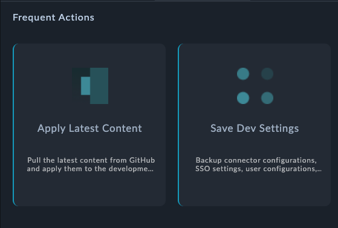

# Card Tiles

Displays a list of records in the Record Card view.

An example of using the record widget would be displaying a list of task in the Record Card view on the Production and Development tab of the Change Management page.

## Version Information

**Version**: 1.0.0

**Certified**: Yes

**Publisher**: Fortinet  

**Compatibility**: 7.2.0 and later

**Applicable**: View Panel and Listing View

## Record Card Views

**Record Card Edit View**:

**Card Tiles - Workspaces Listing**:

## Record Card Settings

Provide the following details to customize the Card Tiles widget to suit your requirements:

| Fields                         | Description                              |
| ------------------------------ | ---------------------------------------- |
| Title                          | Specify the heading or title that you want to give to the records in the record card view. |
| Data Source                    | Select the data source (module) whose records list you want to view in record card. For example, change Management. |
| Max Record Limit               | Select the maximum records that you can view in record card on a particular page. |
| **Select Card Fields Section** | **Specify the fields that you want to add to the record card.** |
| Icon                    | Select the richtext field where the icon image is saved. |
| Title                     | Select the field whose value you want to set as the title of the card. For example, if you select **Title**, then the card will display the value that is set as the title of the record such as `Apply Latest Content` as the title of the card. |
| Subtitle                     | Select the field whose value you want to set as the subtitle in the card. For example, if you select **Description**, then the card will display the description of Change Management record.|
| Card Left Border               | Select the picklist field whose value you want to set as the left border of the card if the selected field's options contain defined color codes. For example, if you select **Environment**, and if the Environment picklist has defined color codes for its options, then the cards' left border gets colored with the status that is set for that record. For example, the left border of the card is set to 'blue' if the record's status field is set to 'Productiion', or the left border of the card is set to 'orange' if the record's status field is set to 'Development'. |
| Filter Criteria                | Specify the filter criteria (optionally) for displaying records in the record card view on a particular page. For example, to display only those records whose Type is Production, you can add a filter criterion such as `Type Equals Production`. |
| Default Sort                   | Specify the sorting parameters (optionally) for displaying records in the record card view on a particular page. |

